# MolGAN: Implicit Generative Model for Small Molecular Graphs

MolGAN is a deep generative model that generates molecular graphs using an implicit, likelihood-free generative adversarial network (GAN). It is designed to generate valid molecular structures efficiently without relying on expensive graph matching or ordering procedures. Additionally, MolGAN integrates a reinforcement learning (RL) objective to enhance the generation of molecules with desired chemical properties.

## Features
- Generates molecular graphs using GANs.
- Reinforcement learning objective to optimize chemical properties.
- Validity, novelty, and uniqueness in molecular generation.
- Utilizes a permutation-invariant discriminator and reward network based on graph convolutions.

## Model Architecture
1. **Generator**: Produces molecular graphs represented by adjacency tensors and annotation matrices.
2. **Discriminator**: Classifies graphs as real or fake.
3. **Reward Network**: Provides feedback based on chemical properties using an external software like RDKit.

## Dependencies
- Python 3.x
- TensorFlow or PyTorch
- RDKit for chemical property evaluation
- Adam optimizer for training

## Usage
1. Clone the repository and install dependencies.
2. Prepare a dataset of molecular graphs (e.g., QM9 dataset).
3. Run the training script:
    ```
    0. Create and activate a virtual environment
    ```

    ```
    1. pip install -r requirements.txt
    ```

    ```
    2. cd data
    ```

    ```
    3. bash download_dataset.sh
    ```

    ```
    4. python sparse_molecular_dataset.py
    ```

    ```
    5. cd ..
    ```

    ```
    6. python main_gan.py
    ```

## Molecule Generation Exhibition
These results are trained with the QM9 dataset. 
### Pure RL (WGAN-Lambda = 0.0)
<p align="center">
    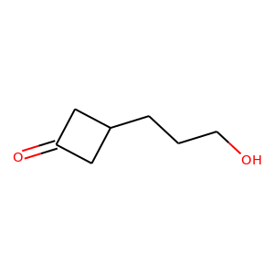
    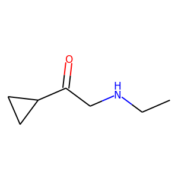
    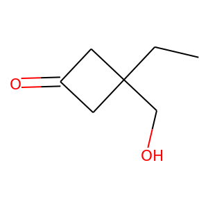
    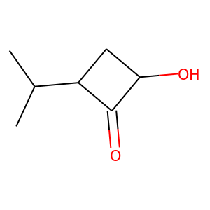
    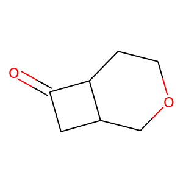
    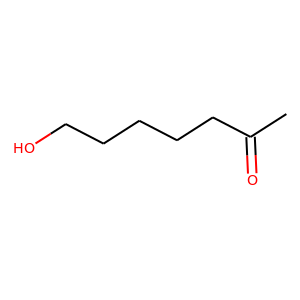
</p>

### Mixture of RL and GAN (WGAN-Lambda = 0.5)
<p align="center">
    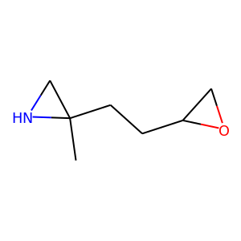
    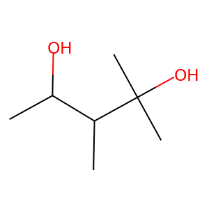
    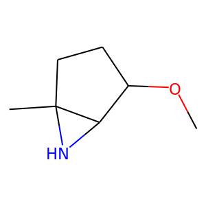
    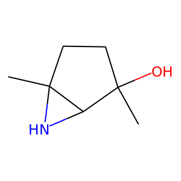
    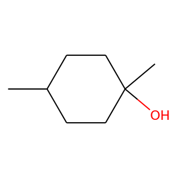
    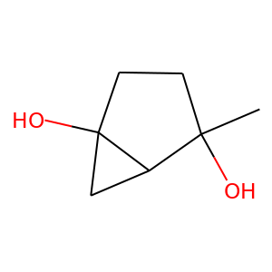
</p>

### Pure GAN (WGAN-Lambda = 1.0)
<p align="center">
    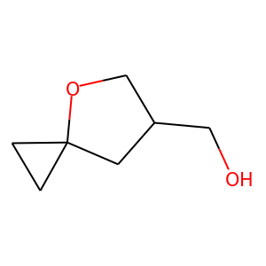
    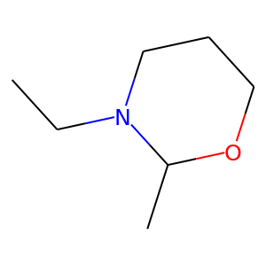
    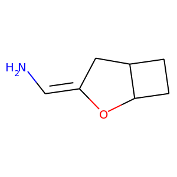
    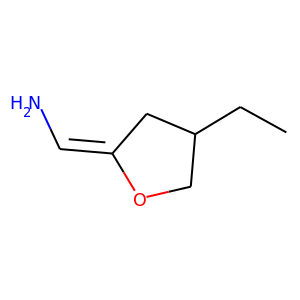
    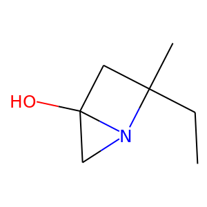
    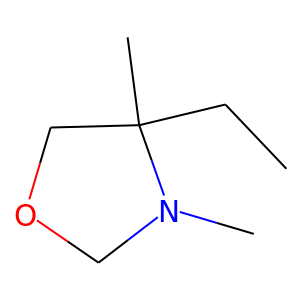
</p>
